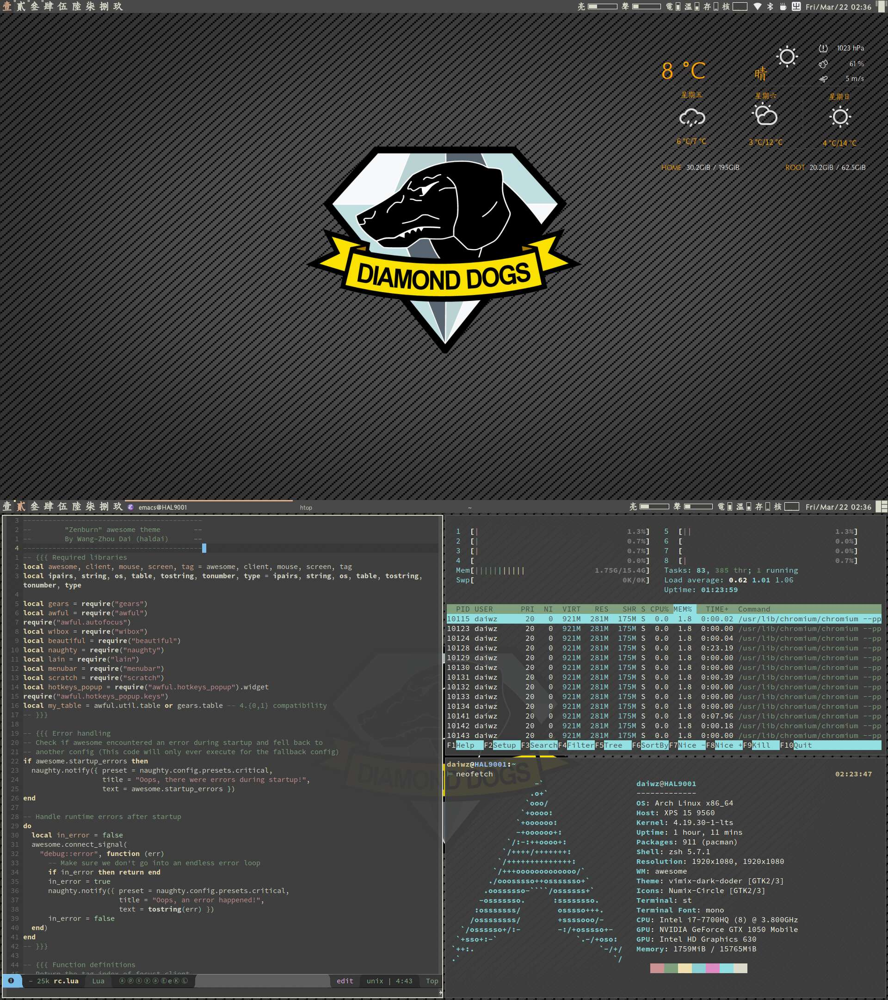

# mydotfiles #
## Dependency ##
All of dependencies can be installed from Archlinux repository and AUR.

For [i3-wm](https://i3wm.org/):

* i3-gaps
* i3blocks-gaps
* i3lock-fancy
* [feh](https://github.com/derf/feh)
* [yad](https://github.com/v1cont/yad)
* rxvt-unicode
* [urxvt-perls](urxvt-perls)

For [awesomewm](https://awesomewm.org/)-zenburn:

* awesome
* [st-0.8.2](https://st.suckless.org/), my tweaks are in
  `suckless/st-haldai.diff`, or directly compile the shipped tarball.
* use `acpilight` instead of `xorg-xbacklight`
* qutebrowser

Fonts:
* nerd-fonts-source-code-pro
* ttf-sarasa-gothic
* ttf-font-awesome-4
* otf-eb-garamond
* otf-vollkorn

Misc:

* conky
* ~~compton-git~~picom
* lm_sensors
* zsh
* oh-my-zsh-git
* zsh-autosuggestions
* udiskie
* rofi-greenclip
* most
* xidlehook
* slock
* jed
* [~~spacemacs~~](http://spacemacs.org/)
* [spaceship-prompt](https://github.com/denysdovhan/spaceship-prompt)
* [dunst](https://dunst-project.org/)
* [ranger](https://github.com/ranger/ranger)

For conky weather script:

* jq
* curl

For network traffic monitor

* vnstat

## Screenshot ##

