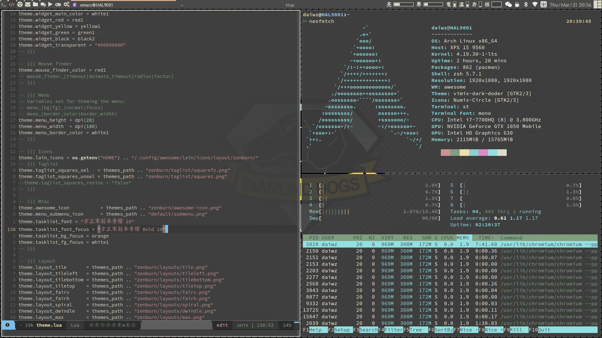

# mydotfiles #
## Dependency ##
All of dependencies can be installed from Archlinux repository and AUR.

* i3-gaps
* i3blocks-gaps
* nerd-fonts-source-code-pro
* powerline-fonts-git
* ttf-font-awesome-4
* conky
* compton-git
* lm_sensors
* zsh
* oh-my-zsh-git
* zsh-autosuggestions
* udiskie
* rofi-greenclip
* most
* jed
* dash
* [spacemacs](http://spacemacs.org/)
* [spaceship-prompt](https://github.com/denysdovhan/spaceship-prompt)
* [urxvt-perls](urxvt-perls)

For conky weather script:

* jq
* curl

For network traffic monitor

* vnstat

Misc:

* [dunst](https://dunst-project.org/)
* [ranger](https://github.com/ranger/ranger)
* [feh](https://github.com/derf/feh)
* [yad](https://github.com/v1cont/yad)

## Screenshot ##

